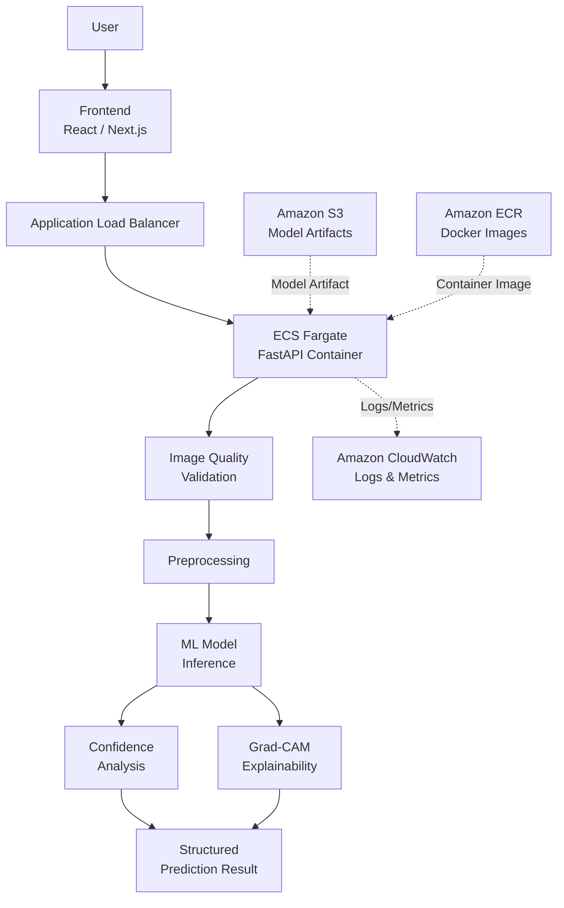

# Brain Tumor Detection and Classification Using MRI Images

<p align="center">

**WDC — AI-Assisted Brain Tumor MRI Classification System**

Computer Vision • Deep Learning • Explainable AI • Cloud • MLOps

</p>

---

## Team WDC

| Role     | Responsibility                  |
| -------- | ------------------------------- |
| Member 1 | Web Development / UI/UX         |
| Member 2 | Deployment / MLOps / Cloud      |
| Member 3 | Model Training                  |
| Member 4 | Data Preparation                |
| Member 5 | Benchmarking / Model Validation |
| Member 6 | Documentation / Validation      |

> Team member names will be added once finalized.

---

# 1. Overview

**Brain Tumor Detection and Classification Using MRI Images** is a computer vision and deep learning project developed by **Team WDC**.

The project aims to develop an **AI-assisted system for classifying brain MRI images** into the tumor categories represented in the selected dataset.

The system combines:

* Computer Vision
* Deep Learning
* Transfer Learning
* Explainable AI
* Image Quality Validation
* Confidence-Aware Prediction
* Web Application Development
* Containerization
* Cloud Deployment
* Infrastructure as Code
* Monitoring

The project is designed as a **six-day engineering sprint**, with each team member responsible for a specific technical area.

---

# 2. Problem Statement

Early detection and classification of brain tumors is an important problem in medical imaging.

Brain tumors can increase intracranial pressure and may become life-threatening as they progress.

Traditional MRI analysis requires trained medical professionals and can be time-consuming.

This project investigates how computer vision and deep learning can assist in the **classification of brain MRI images**.

The system is intended to demonstrate the technical feasibility of an AI-assisted MRI classification workflow while also addressing important engineering concerns such as:

* Input validation
* Model confidence
* Explainability
* Deployment
* Monitoring
* Reproducibility

---

# 3. Objective

The primary objective is to develop an AI-assisted brain MRI classification system that can:

1. Accept an MRI image from a user.
2. Perform basic image quality and validity checks.
3. Preprocess the image.
4. Run the image through a trained deep learning model.
5. Predict the evaluated MRI category.
6. Provide model confidence information.
7. Generate an explainability visualization using Grad-CAM where supported.
8. Present the prediction in a structured interface.
9. Provide appropriate model and medical disclaimers.
10. Deploy the inference system to AWS.
11. Monitor the deployed application.
12. Maintain a reproducible development and deployment workflow.

---

# 4. Project Scope

Because the team has **six days** to develop the project, the scope is intentionally limited.

## MVP Features

### Core Classification

The system will classify MRI images using a trained deep learning model.

### MRI Quality / Validity Assessment

A lightweight rule-based validation layer will check whether an uploaded image is reasonably suitable for processing.

### Confidence-Aware Prediction

The system will display the model's prediction confidence and an appropriate confidence level.

### Explainable AI

Grad-CAM will be used where compatible with the selected model to visualize regions that influenced the model prediction.

### Structured Prediction Result

The final result will combine:

* Predicted class
* Confidence
* Class probabilities where available
* Explainability visualization
* Model version
* Timestamp
* Disclaimer

### Cloud Deployment

The backend/inference service is planned to be deployed using:

**Docker → Amazon ECR → Amazon ECS Fargate → Application Load Balancer**

with:

**Terraform + CloudWatch**

for infrastructure and monitoring.

---

# 5. Dataset

## Brain Tumor MRI Dataset

Source:

**Kaggle — Brain Tumor MRI Dataset**

https://www.kaggle.com/datasets/masoudnickparvar/brain-tumor-mri-dataset

The dataset will be used for training and evaluating the image classification models.

### Dataset Verification

The following information will be populated after the Data Preparation team verifies the downloaded dataset:

| Property           | Value |
| ------------------ | ----- |
| Total Images       | TBD   |
| Number of Classes  | TBD   |
| Image Dimensions   | TBD   |
| Training Images    | TBD   |
| Validation Images  | TBD   |
| Test Images        | TBD   |
| Class Distribution | TBD   |
| Dataset Version    | TBD   |

Potential categories commonly associated with the dataset include:

* Glioma
* Meningioma
* Pituitary
* No Tumor

**These categories must be verified against the actual downloaded dataset before being treated as final project labels.**

---

# 6. Data Preparation

The data preparation pipeline will investigate:

* Dataset structure
* Class distribution
* Corrupted images
* Duplicate images
* Image dimensions
* Image quality
* Image normalization
* Image resizing
* Data augmentation
* Train/validation/test splitting

## Data Leakage

Particular attention will be given to potential data leakage.

If multiple images originate from the same patient and patient-level information is available, patient-level splitting should be considered.

The project must not claim patient-level separation unless the available dataset actually supports it.

---

# 7. System Workflow

The proposed workflow is:

```text
                    User
                     │
                     ▼
              Upload MRI Image
                     │
                     ▼
          Image Quality / Validation
                     │
              ┌──────┴──────┐
              │             │
           Invalid         Valid
              │             │
              ▼             ▼
           Reject       Preprocessing
                            │
                            ▼
                       ML Inference
                            │
                ┌───────────┼───────────┐
                │           │           │
                ▼           ▼           ▼
           Prediction   Confidence   Grad-CAM
                │           │           │
                └───────────┼───────────┘
                            │
                            ▼
                 Structured Result
                            │
                            ▼
                         User
```

---

# 8. Proposed Architecture

The system is designed with separation between the frontend, backend, ML inference layer, and cloud infrastructure.



> This is the **proposed deployment architecture**. AWS components will be marked as implemented only after successful deployment.

---

# 9. Architecture Components

## Frontend

The frontend provides:

* MRI upload
* Image preview
* Prediction request
* Loading state
* Prediction result
* Confidence information
* Grad-CAM visualization
* Error handling
* Medical disclaimer

The final frontend framework will be confirmed by the Web Development team.

Potential technologies:

* React
* Next.js
* JavaScript / TypeScript

---

## Backend

The backend will provide the API connecting the frontend to the ML inference system.

Potential technology:

**FastAPI**

Expected conceptual endpoints:

```text
GET  /health
POST /predict
```

### `/health`

Used to determine whether the backend service is running correctly.

Example response:

```json
{
  "status": "healthy"
}
```

### `/predict`

Accepts an MRI image and returns prediction information.

Conceptual response:

```json
{
  "prediction": "TBD",
  "confidence": 0.0,
  "model_version": "v1.0",
  "inference_time_ms": 0
}
```

> The final API schema will be determined by the Backend and ML teams.

---

# 10. Machine Learning Approach

The ML pipeline will follow an incremental approach.

## Stage 1 — Baseline

Establish a baseline deep learning model to verify:

* preprocessing
* dataset pipeline
* training
* validation
* inference

---

## Stage 2 — Transfer Learning

Because of the six-day development constraint, transfer learning will be prioritized.

Potential candidate architectures include:

* ResNet18
* EfficientNet-B0
* Other lightweight architectures selected by the Model Training team

The final model will be selected based on actual experimental results.

---

## Stage 3 — Model Selection

The final model should consider more than accuracy.

Selection factors may include:

* Accuracy
* Precision
* Recall
* F1-score
* Inference latency
* Model size
* Resource requirements
* Explainability compatibility

---

# 11. Model Evaluation

The project will evaluate models using:

* Accuracy
* Precision
* Recall
* F1-score
* Confusion Matrix
* Per-class performance
* Inference time where practical

## Results

| Metric         | Result |
| -------------- | -----: |
| Accuracy       |    TBD |
| Precision      |    TBD |
| Recall         |    TBD |
| F1-score       |    TBD |
| Inference Time |    TBD |

No performance value will be reported until it has been experimentally measured.

---

# 12. Experiment Tracking

Experiments will be documented using a table similar to:

| Experiment | Model | Preprocessing | Epochs | Learning Rate | Accuracy | Precision | Recall |  F1 | Notes    |
| ---------- | ----- | ------------- | -----: | ------------: | -------: | --------: | -----: | --: | -------- |
| EXP-001    | TBD   | TBD           |    TBD |           TBD |      TBD |       TBD |    TBD | TBD | Baseline |
| EXP-002    | TBD   | TBD           |    TBD |           TBD |      TBD |       TBD |    TBD | TBD | TBD      |
| EXP-003    | TBD   | TBD           |    TBD |           TBD |      TBD |       TBD |    TBD | TBD | TBD      |

---

# 13. Key Innovations

The project intentionally focuses on a small number of meaningful improvements rather than adding unrelated technologies.

## 13.1 MRI Quality / Validity Gate

Before inference, the system performs lightweight image checks.

Potential checks include:

* Resolution
* Blur
* Brightness
* Contrast
* Grayscale characteristics
* Aspect ratio
* Basic file validity

Conceptual flow:

```text
MRI Upload
    │
    ▼
Quality Check
    │
    ├── Invalid ──→ Reject
    │
    └── Valid ───→ Model
```

The initial implementation will use a **rule-based approach**.

A separate learned quality classifier is outside the six-day MVP scope.

---

# 14. Confidence-Aware Prediction

The system will display the model's confidence information alongside the predicted class.

Example:

```text
Prediction
---------
Glioma

Model Confidence
---------
94%

Confidence Level
---------
High
```

The exact confidence thresholds will be determined from validation experiments where possible.

## Important

Model confidence must not be interpreted as a clinical probability.

For example:

> 94% model confidence does not mean there is a 94% probability that the patient has a tumor.

The confidence represents the model's internal prediction score for the evaluated classes.

---

# 15. Explainable AI — Grad-CAM

Grad-CAM will be investigated for supported CNN-based models.

Conceptual workflow:

```text
MRI Image
    │
    ▼
CNN Model
    │
    ├───────────────→ Prediction
    │
    └───────────────→ Grad-CAM
                          │
                          ▼
                     Heatmap
                          │
                          ▼
                    Image Overlay
```

The heatmap will show regions that influenced the model prediction.

## Important Limitation

Grad-CAM does not prove that a tumor exists in the highlighted region.

It represents areas that contributed to the model's prediction.

This distinction will be clearly communicated in the application and documentation.

---

# 16. Structured Prediction Result

The final interface will combine the available prediction information into one result.

Example:

```text
┌─────────────────────────────────────────┐
│              MRI ANALYSIS               │
├─────────────────────────────────────────┤
│                                         │
│ Prediction:       Glioma                │
│ Confidence:       94%                   │
│ Confidence Level: High                  │
│                                         │
│ Class Probabilities                     │
│ ─────────────────────────────────────── │
│ Glioma            94%                   │
│ Meningioma         3%                   │
│ Pituitary          2%                   │
│ No Tumor           1%                   │
│                                         │
│ Model Version:    v1.0                  │
│ Inference Time:   TBD                   │
│                                         │
│        [ Grad-CAM Visualization ]       │
│                                         │
├─────────────────────────────────────────┤
│ Academic prototype — not a diagnosis.   │
└─────────────────────────────────────────┘
```

Values shown above are examples only.

Actual values will come from the trained model.

---

# 17. Deployment Architecture

The Deployment / MLOps team will transform the locally working application into a cloud-hosted system.

Target architecture:

```text
Local Application
       │
       ▼
     Docker
       │
       ▼
 Amazon ECR
       │
       ▼
 ECS Fargate
       │
       ▼
 Application Load Balancer
       │
       ▼
 Public API
       │
       ▼
 Frontend
```

---

# 18. Docker

The backend/inference service will be containerized.

Expected flow:

```text
FastAPI
   +
ML Model
   +
Dependencies
   │
   ▼
Docker Image
```

Local validation:

```bash
docker build -t brain-tumor-api .
```

```bash
docker run -p 8000:8000 brain-tumor-api
```

The container must be tested locally before being deployed to AWS.

---

# 19. Amazon ECR

Amazon Elastic Container Registry will be used as the container image registry.

Flow:

```text
Docker Image
      │
      ▼
     ECR
      │
      ▼
brain-tumor-api:v1
```

Versioned images will allow deployment of known application versions.

---

# 20. Amazon ECS Fargate

The backend container is planned to run using:

**Amazon ECS + AWS Fargate**

Conceptual flow:

```text
ECR
 │
 ▼
ECS Task Definition
 │
 ▼
ECS Service
 │
 ▼
Fargate Task
 │
 ▼
FastAPI + ML Inference
```

Fargate removes the need for the team to manage individual EC2 servers for the container workload.

---

# 21. Application Load Balancer

An Application Load Balancer will sit in front of the ECS service.

```text
Internet
   │
   ▼
ALB
   │
   ▼
ECS Fargate
   │
   ▼
FastAPI
```

The load balancer can also perform health checks against the backend.

Expected health endpoint:

```text
GET /health
```

---

# 22. Amazon S3

S3 may be used for:

* model artifacts
* deployment artifacts
* project assets
* other non-sensitive objects where appropriate

Model storage strategy will be finalized after the model file size and deployment requirements are known.

Uploaded MRI images should not be permanently stored unless there is a clear project requirement.

---

# 23. CloudWatch Monitoring

Amazon CloudWatch will be used for basic operational monitoring.

Potential metrics/logs:

* Container logs
* Application errors
* CPU utilization
* Memory utilization
* Service health
* Request behaviour
* Inference-related operational metrics

Conceptual flow:

```text
ECS
 │
 ├── Logs
 ├── Errors
 ├── Metrics
 │
 ▼
CloudWatch
```

The six-day MVP will prioritize lightweight monitoring rather than a full enterprise observability stack.

---

# 24. Terraform — Infrastructure as Code

Terraform will be used to make AWS infrastructure reproducible.

Planned resources include:

```text
Terraform
   │
   ├── VPC
   ├── Subnets
   ├── Security Groups
   ├── IAM
   ├── S3
   ├── ECR
   ├── ECS Cluster
   ├── ECS Service
   ├── Task Definition
   ├── ALB
   └── CloudWatch
```

The infrastructure will initially be developed and tested carefully before being treated as the final deployment configuration.

---

# 25. CI/CD

The proposed CI/CD pipeline uses GitHub Actions.

```text
Developer
    │
    ▼
Git Push
    │
    ▼
GitHub
    │
    ▼
GitHub Actions
    │
    ├── Tests
    ├── Build
    ├── Docker Build
    ├── Security Checks
    │
    ▼
Amazon ECR
    │
    ▼
ECS Deployment
```

The exact pipeline will be implemented after the local application and Docker image are stable.

---

# 26. Why Kubernetes Is Not in the MVP

Kubernetes/EKS is intentionally excluded from the six-day MVP.

Although Kubernetes could provide advanced orchestration capabilities, it would introduce additional complexity around:

* cluster management
* networking
* IAM
* services
* ingress
* pods
* deployments
* scaling
* monitoring

For this project, ECS Fargate provides a simpler container deployment path.

Kubernetes/EKS may be explored as future work.

---

# 27. Security

Security considerations include:

* Never commit secrets to Git.
* Store configuration using environment variables or appropriate secret-management mechanisms.
* Use `.gitignore` for `.env` files.
* Apply least-privilege IAM policies.
* Restrict security-group access.
* Validate uploaded files.
* Limit upload size.
* Sanitize file names.
* Use HTTPS for public communication.
* Avoid unnecessary storage of uploaded MRI images.
* Do not expose AWS credentials in frontend code.
* Restrict access to cloud resources.
* Log operational events without unnecessarily storing sensitive information.

---

# 28. Medical AI Disclaimer

> **Important:** This project is an academic/research prototype for brain MRI image classification. It is not a medical diagnostic device and has not been clinically validated. Model predictions and confidence scores must not be interpreted as medical diagnoses or clinical probabilities. The system is not intended to replace qualified medical professionals.

This disclaimer should be visible in the user interface as well as the documentation.

---

# 29. Repository Structure

The proposed repository structure is:

```text
brain-tumor-detection/
│
├── README.md
├── LICENSE
├── .gitignore
│
├── frontend/
│
├── backend/
│
├── ml/
│   ├── preprocessing/
│   ├── training/
│   ├── evaluation/
│   └── inference/
│
├── models/
│
├── data/
│
├── tests/
│
├── docs/
│
├── infra/
│   └── terraform/
│
├── docker/
│
├── scripts/
│
└── .github/
    └── workflows/
```

The structure may be adjusted as implementation progresses.

---

# 30. Team Responsibilities

## Member 1 — Web Development

Responsibilities:

* UI/UX
* MRI upload
* Image preview
* Prediction interface
* Confidence display
* Grad-CAM visualization
* Structured result
* Frontend/backend integration

---

## Member 2 — Deployment / MLOps

Responsibilities:

* Docker
* Container testing
* Amazon ECR
* Amazon ECS
* AWS Fargate
* Application Load Balancer
* Terraform
* CloudWatch
* CI/CD
* Deployment documentation
* Cloud security

---

## Member 3 — Model Training

Responsibilities:

* Model architecture
* Transfer learning
* Training
* Hyperparameter configuration
* Model selection
* Model checkpoint
* Inference integration
* Grad-CAM integration

---

## Member 4 — Data Preparation

Responsibilities:

* Dataset acquisition
* Dataset validation
* Data cleaning
* Class distribution
* Image preprocessing
* Augmentation
* Dataset splitting
* Data leakage checks

---

## Member 5 — Benchmarking / Validation

Responsibilities:

* Accuracy
* Precision
* Recall
* F1-score
* Confusion matrix
* Per-class evaluation
* Inference benchmarking
* Model validation
* Error analysis

---

## Member 6 — Documentation

Responsibilities:

* README
* Architecture documentation
* Experiment documentation
* Model validation documentation
* Scrum tracking
* Final report
* Presentation
* Demo documentation

---

# 31. Scrum Workflow

The team will use a lightweight Scrum-style workflow with daily review and demonstration.

## Scrum Board

```text
┌──────────┐
│ Backlog  │
└────┬─────┘
     ↓
┌──────────┐
│  To Do   │
└────┬─────┘
     ↓
┌──────────────┐
│ In Progress  │
└──────┬───────┘
       ↓
┌──────────────┐
│ Code Review  │
└──────┬───────┘
       ↓
┌──────────┐
│ Testing  │
└────┬─────┘
     ↓
┌──────────┐
│   Done   │
└──────────┘

Blocked → separate blocker tracking
```

---

# 32. Daily Scrum Review

Each member should report:

### Yesterday

What was completed?

### Today

What will be completed?

### Blockers

What is preventing progress?

### Demo

What can be demonstrated?

### Evidence

Examples:

* Git commit
* Pull request
* Screenshot
* Model metric
* API response
* Docker image
* Deployment
* Documentation

### Next Step

What happens next?

---

# 33. Six-Day Roadmap

| Day   | Data                 | Model          | Web                  | Deployment                    | Validation          | Documentation      |
| ----- | -------------------- | -------------- | -------------------- | ----------------------------- | ------------------- | ------------------ |
| **1** | Dataset verification | Training setup | UI wireframe         | Repo + environment            | Metrics plan        | Architecture       |
| **2** | Preprocessing        | Baseline model | Upload UI            | Inference API/container prep  | First evaluation    | Documentation      |
| **3** | Quality rules        | Model tuning   | API integration      | Docker + AWS preparation      | Precision/Recall/F1 | Feature docs       |
| **4** | Validation           | Grad-CAM       | Confidence + heatmap | Versioning/deployment         | Grad-CAM validation | Disclaimer/docs    |
| **5** | —                    | Freeze model   | Structured result    | AWS end-to-end deployment     | Final metrics       | README             |
| **6** | —                    | —              | UI polish            | Final deployment + monitoring | Demo package        | Final presentation |

---

# 34. Definition of Done

A general task is considered complete when:

* Implementation is complete.
* Code has been committed.
* Basic testing is complete.
* Documentation is updated.
* Required evidence exists.
* No known blocker remains.

## ML Definition of Done

Additionally:

* Dataset version recorded
* Experiment configuration recorded
* Metrics recorded
* Model checkpoint saved
* Evaluation completed

## Deployment Definition of Done

Additionally:

* Docker image builds
* Container runs locally
* Health endpoint works
* API works
* AWS deployment succeeds
* Logs are accessible
* Deployment can be reproduced

---

# 35. Deployment Handoff Requirements

Before the Deployment/MLOps member begins cloud deployment, the ML and Backend teams should provide:

## ML Team

```text
[ ] Final model file
[ ] Framework
[ ] Python version
[ ] Dependencies
[ ] Input image requirements
[ ] Preprocessing logic
[ ] Output classes
[ ] Inference function
[ ] Model version
[ ] Model size
[ ] CPU/GPU requirements
```

## Backend Team

```text
[ ] Source code
[ ] requirements.txt
[ ] Startup command
[ ] Port
[ ] API documentation
[ ] /health endpoint
[ ] /predict endpoint
[ ] Request schema
[ ] Response schema
[ ] Environment variables
[ ] CORS requirements
```

## Frontend Team

```text
[ ] Source code
[ ] Framework
[ ] Node version
[ ] Build command
[ ] API URL configuration
[ ] Environment variables
[ ] Production build instructions
```

---

# 36. Local-to-AWS Deployment Flow

The intended deployment process is:

```text
               LOCAL

Frontend
   │
   ▼
Backend
   │
   ▼
ML Model
   │
   ▼
Prediction


               ↓

          DOCKERIZE

               ↓

        Local Container Test

               ↓

             ECR

               ↓

        ECS Fargate

               ↓

             ALB

               ↓

        Public HTTPS API

               ↓

           Frontend

               ↓

            USER
```

This ensures the application is first proven locally before cloud deployment.

---

# 37. Current Project Status

## Completed

* Problem statement identified
* Dataset selected
* Objective defined
* Project scope defined
* Team roles discussed
* Existing approaches discussed
* Innovation analysis completed
* Option A selected
* Six-day development constraint established
* Initial deployment strategy defined

## In Progress

* Dataset preparation
* Model training
* Frontend development
* Backend development
* API integration
* Deployment preparation

## Planned

* Dockerization
* Amazon ECR
* Amazon ECS Fargate
* Application Load Balancer
* Amazon S3
* CloudWatch
* Terraform
* GitHub Actions
* Public cloud deployment

---

# 38. Evaluation Criteria Alignment

| Evaluation Area        | WDC Project Response                                        |
| ---------------------- | ----------------------------------------------------------- |
| Use Case Understanding | Brain MRI classification workflow                           |
| Process Flow           | Upload → validation → preprocessing → inference → result    |
| Architecture           | Frontend + API + ML inference + AWS                         |
| Innovation             | Quality gate + confidence + Grad-CAM + structured result    |
| UI/UX                  | Upload, visualization, confidence, structured result        |
| Technical Quality      | Modular architecture, Docker, testing                       |
| Model Performance      | Accuracy, precision, recall, F1, confusion matrix           |
| Deployment             | Docker + ECR + ECS Fargate + ALB                            |
| Infrastructure         | Terraform                                                   |
| Monitoring             | CloudWatch                                                  |
| Reusability            | Modular preprocessing, inference and deployment             |
| Integration            | Frontend → API → ML model                                   |
| Real-Time Capability   | Inference latency will be measured where practical          |
| Documentation          | README, architecture, experiments, deployment documentation |
| Teamwork               | Six defined roles + Scrum workflow                          |
| Presentation           | Live application + architecture + metrics + deployment demo |

---

# 39. Innovation vs Engineering

The project deliberately avoids adding unrelated technologies simply to appear innovative.

The primary innovation direction is:

```text
Traditional Classifier
       │
       ▼
     Prediction
```

becoming:

```text
                 MRI
                  │
                  ▼
           Quality Assessment
                  │
                  ▼
             ML Model
              /     \
             /       \
            ▼         ▼
     Confidence     Grad-CAM
            \         /
             \       /
              ▼     ▼
          Structured
            Result
```

This makes the system more transparent and robust while keeping the scope achievable within six days.

---

# 40. What We Are NOT Building in the MVP

The following are intentionally excluded:

* True tumor segmentation
* U-Net
* Pixel-level tumor masks
* Clinical diagnosis
* Patient medical-record management
* PACS integration
* DICOM clinical workflow
* Blockchain
* Cryptocurrency
* LLM chatbot
* Federated learning
* Kubernetes/EKS
* Advanced MC Dropout uncertainty
* Deep ensembles
* Advanced OOD research
* Mobile application

These may be considered future research directions.

---

# 41. Limitations

The project has several limitations.

### Dataset

The dataset may not represent the full diversity of real-world MRI scans.

### Generalization

Strong performance on the selected dataset does not guarantee performance on external datasets.

### Data Leakage

Improper dataset splitting may produce overly optimistic results.

### Clinical Validation

The model has not undergone clinical validation.

### Confidence

Model confidence is not equivalent to clinical probability.

### Explainability

Grad-CAM is an interpretation technique and does not prove that a highlighted region is a tumor.

### Quality Assessment

Rule-based quality checks can identify obvious image problems but cannot guarantee clinical suitability.

### Deployment

Successful AWS deployment demonstrates engineering feasibility, not clinical readiness.

---

# 42. Future Scope

Possible future work includes:

* Temperature-scaled confidence calibration
* Advanced OOD detection
* MC Dropout uncertainty estimation
* Multi-model ensembles
* Vision Transformer benchmarking
* Model registry
* Automated model versioning
* Advanced monitoring
* Model drift detection
* Kubernetes/EKS deployment
* Advanced MLOps
* Larger datasets
* Multi-center datasets
* Patient-level metadata
* Clinical validation
* True tumor segmentation using an appropriately annotated dataset
* DICOM support
* Clinical integration research

---

# 43. Local Development

Exact commands will be finalized after the frontend and backend stacks are confirmed.

## Backend

```bash
# Install dependencies
TBD

# Start backend
TBD
```

## Frontend

```bash
# Install dependencies
TBD

# Start development server
TBD
```

## Docker

Once the backend Dockerfile is finalized:

```bash
docker build -t brain-tumor-api .
```

Run locally:

```bash
docker run -p 8000:8000 brain-tumor-api
```

Test:

```text
http://localhost:8000/health
```

---

# 44. AWS Deployment

The planned deployment sequence is:

### Step 1

Build and test the Docker image locally.

### Step 2

Push the image to Amazon ECR.

### Step 3

Create/update the ECS task definition.

### Step 4

Deploy the container using ECS Fargate.

### Step 5

Configure the Application Load Balancer.

### Step 6

Configure health checks.

### Step 7

Connect the frontend to the public API.

### Step 8

Configure CloudWatch logs and metrics.

### Step 9

Convert/provision infrastructure using Terraform.

### Step 10

Automate deployment through GitHub Actions.

---

# 45. Project Evidence

The team should maintain evidence throughout the six-day sprint.

Examples:

* Git commits
* Pull requests
* Dataset analysis screenshots
* Training logs
* Model metrics
* Confusion matrices
* Grad-CAM examples
* API responses
* Docker build
* ECR image
* ECS service
* AWS architecture
* CloudWatch logs
* Terraform plan/apply output
* Frontend screenshots
* Final demo

This evidence will support the final presentation and evaluation.

---

# 46. Reproducibility

The project should document:

* Python version
* Node version
* Dependency versions
* Dataset source
* Dataset version
* Preprocessing configuration
* Random seeds where applicable
* Model configuration
* Training parameters
* Model version
* Docker image version
* Infrastructure configuration

The goal is to make the project reproducible by another team member.

---

# 47. Contributing

Team members should work through Git branches and pull requests where practical.

Suggested workflow:

```text
main
 │
 ├── feature/frontend
 ├── feature/backend
 ├── feature/ml
 ├── feature/data
 ├── feature/deployment
 └── feature/docs
```

Recommended process:

```text
Create Branch
     ↓
Implement
     ↓
Test
     ↓
Commit
     ↓
Push
     ↓
Pull Request
     ↓
Review
     ↓
Merge
```

---

# 48. License

License:

**TBD**

The team should select an appropriate open-source license after checking dataset licensing and project requirements.

---

# 49. Project Status Summary

```text
┌─────────────────────────────────────────────┐
│             WDC PROJECT STATUS              │
├─────────────────────────────────────────────┤
│                                             │
│ Problem Definition              ✓           │
│ Dataset Selection               ✓           │
│ Innovation Selection            ✓           │
│ Six-Day Scope                   ✓           │
│                                             │
│ Data Preparation                IN PROGRESS  │
│ Model Training                  IN PROGRESS  │
│ Backend                         IN PROGRESS  │
│ Frontend                        IN PROGRESS  │
│                                             │
│ Docker                          PLANNED      │
│ AWS ECR                         PLANNED      │
│ ECS Fargate                     PLANNED      │
│ ALB                             PLANNED      │
│ Terraform                       PLANNED      │
│ CloudWatch                      PLANNED      │
│ CI/CD                           PLANNED      │
│                                             │
└─────────────────────────────────────────────┘
```

---

# 50. Final Project Vision

The final WDC system aims to demonstrate a complete engineering pipeline rather than only a trained machine learning model.

```text
                    WDC
                     │
                     ▼
             Brain MRI Image
                     │
                     ▼
             Quality Validation
                     │
                     ▼
               Preprocessing
                     │
                     ▼
                ML Inference
                  /      \
                 /        \
                ▼          ▼
          Confidence     Grad-CAM
                \          /
                 \        /
                  ▼      ▼
              Structured
                Result
                  │
                  ▼
             Web Application
                  │
                  ▼
              Dockerized
                  │
                  ▼
                 ECR
                  │
                  ▼
            ECS Fargate
                  │
                  ▼
                 ALB
                  │
                  ▼
             CloudWatch
                  │
                  ▼
             AWS Platform
```

The project combines **AI, Computer Vision, Explainable AI, Software Engineering, Cloud Infrastructure, and MLOps** into one demonstrable system.

---

## Disclaimer

**This project is an academic/research prototype and is not a medical diagnostic system. It has not been clinically validated. Predictions and model confidence scores must not be interpreted as medical diagnoses or clinical probabilities. Always consult qualified medical professionals for medical decisions.**

---

# WDC — Six Days. One System. One Demo.
